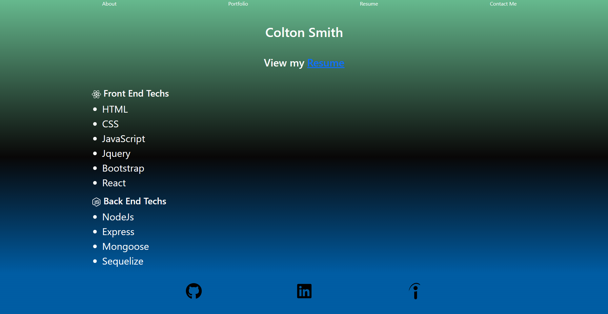

# portfolio-react
https://github.com/coltonsmith135/portfolio-react

# Description
This is a portfolio created using react for a better UI experience
# Table of Contents:
* [Installation](#installation)
* [Usage](#usage)

 * [License](#License)

* [Credits](#credits)
* [Tests](#tests)

## installation

NodeJs, React, react-bootstrap, react-icons, react-scripts, bootstrap

## contact info

coltonsmith135@yahoo.com

503 432 0228

## usage

It is used to give future employers an insight into skills and various projects that i have created throughout my coding carear.

## License

  MIT

## credits

Colton Smith

## tests

using react

Screenshots

